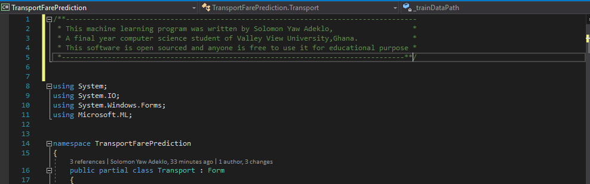
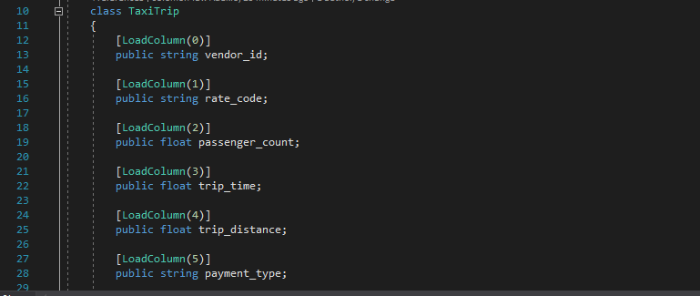
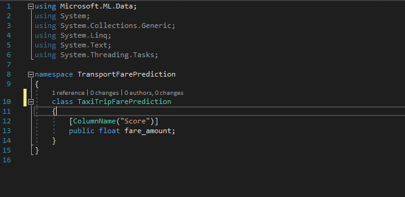
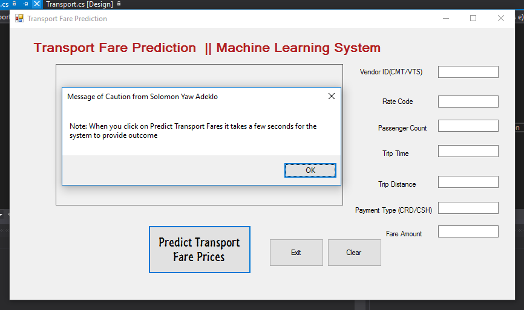
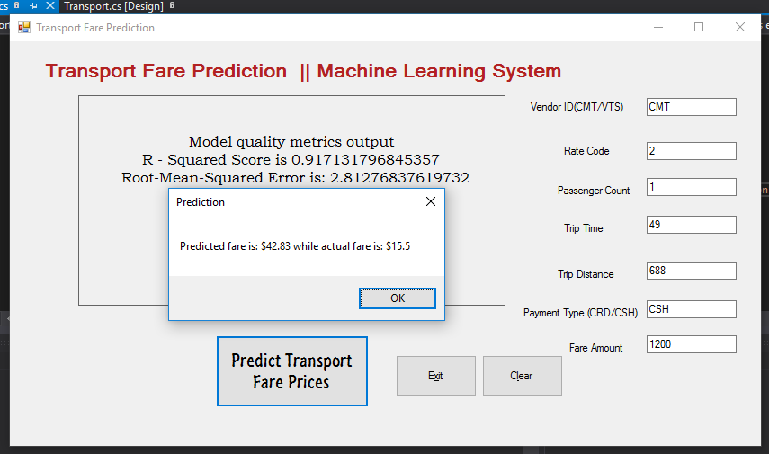
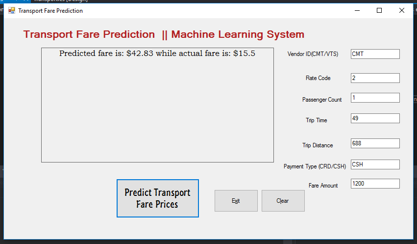

# Transport Fare Prices Prediction System
 A machine learning model using regression analysis - Built with ML.NET Framework
 
 
 
 /**------------------------------------------------------------------------------------
 * This machine learning program was written by Solomon Yaw Adeklo,                   *
 * A final year computer science student of Valley View University,Ghana.             * 
 * This software is open sourced and anyone is free to use it for educational purpose * 
 *----------------------------------------------------------------------------------**/
 
 This is a machine learning model for predicting the price of transport fair using regression analysis algorithm.The system was trained with some dataset which have been labeled for supervised learning.  
 
# Dataset
The data in the data fields contain the following fields:

  vendor_id: Unique ID of the taxi vendor.
  
  rate_code: rate type of the taxi trip.
  
passenger_count: number of passengers for the trip.

trip_time_in_secs: The amount of time the trip took.
trip_distance: The distance of the trip.

payment_type: The payment method  – either credit card or cash
fare_amount: The total taxi fare paid is the label to be predicted

# Classes
Two classes were created, one class to hold features and the other class to hold the prediction

Below is the code for the TaxiTrip Class

Below is the code for the TransportFarePrediction Class

# Functions
There were three functions that were deployed. The are:

The Train() function which The Train() function is a function that build and trains the model by executing the following:

The Evaluate() function is used to assess the model’s performance. Accuracy for  example.

Finally the TestSinglePrediction() method makes a prediction based on a single input record

# Below are the snapshots of the program

